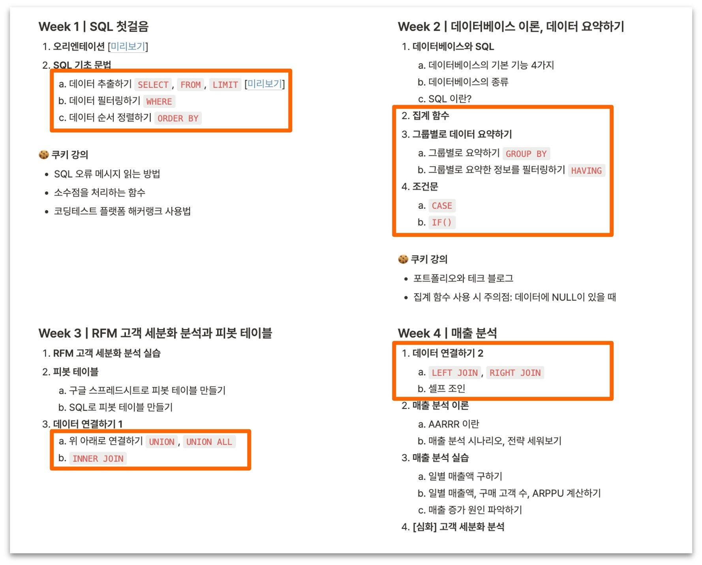
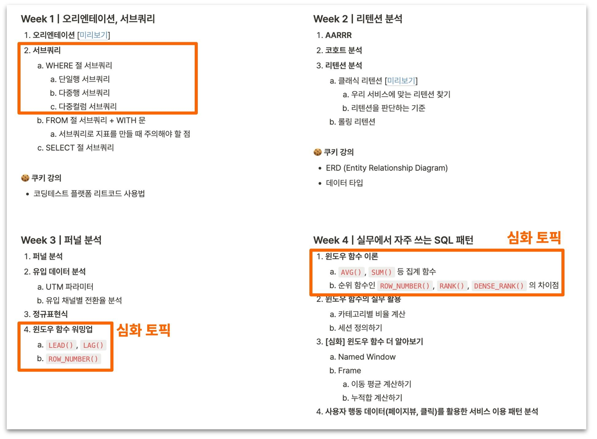

## SQL 코딩테스트?
데이터 분석 직무의 코딩 테스트를 SQL 코딩 테스트라고 합니다. 알로리즘 코딩 테스트만 준비해왔던 저에겐 생소한 단어였습니다.
당장 면접이 얼마남지 않은 시점에서 이전에 배웠던 기억을 더듬어 빠르게 준비하였습니다.
저와 같은 사람들이 많을 것 같기에 도움이 되고자 기록을 남겨봅니다.

## 
https://solvesql.com/
https://www.hackerrank.com/
https://school.programmers.co.kr/learn/challenges?tab=sql_practice_kit

어디까지 공부해야 하나요?
이제 고민이 되는 건 '이걸 어디까지 공부해야 하나'일거예요.
Business Analyst, Data Analyst 직무에서 SQL 코딩테스트를 요구하는데요. 수준이 어느정도인지 알 수 있을까요?
어느 정도 수준까지 문제를 풀어야 SQL 코딩테스트를 합격할 수 있을까요?
 
SQL이라는 언어가 데이터베이스를 조작하는 언어이기 때문에 사실 데이터 분석가에게만 필요한 언어가 아니고 백엔드 엔지니어 분들도 공부를 하십니다. 
데이터 분석가는 SQL에서도 이미 있는 데이터를 추출하는 문법에 집중해서 공부하면 충분한데요. 간혹 INSERT, UPDATE, DELETE 같이 새로운 데이터를 만들거나 업데이트하거나 삭제하는, 그러니까 백엔드 엔지니어 분들이 필요한 문법 파트를 공부하시는 분들도 있더라고요. 아마 'SQL이 중요합니다'까지는 들었는데 이 SQL 안에서도 어떤 문법들이 데이터 분석가에게 중요한지에 대해서는 모르시는 분이겠죠. 그래서 저는 오늘 데이터 분석가에게 필요한 문법 범위를 좀 어느 정도 정해드리려고 합니다.

문법
이제 공부를 시작하신 분들이라면 방향을 잘 잡는 게 중요한데요. 저희가 SQL 데이터 분석 캠프 커리큘럼을 정말 정말 고심해서 만들었어요. 그래서 이 커리큘럼을 보면서 참고하시면 좋겠습니다. 
꼭 저희 강의를 들으시라는 말은 아니고요. 책이나 다른 인터넷 자료 같은 걸로 공부를 시작하더라도 데이터리안의 데이터 분석 캠프 입문반, 실전반 각 커리큘럼에 어떤 문법들이 포함이 되어 있는지를 꼭 확인해 보시면 좋겠어요. 이 커리큘럼에 있는 내용 이외의 것들은 '데이터 분석가들이 많이 쓰는 문법은 아니겠구나'라고 생각해 주셔도 괜찮습니다.

실전반 과정 중에, 서브 쿼리는 꼭 아셔야 되는 토픽 중에 입니다. 윈도우 함수는 제가 심화 토픽이라고 적어 놨는데, 요즘 데이터 분석가 SQL 코딩테스트에는 윈도우 함수를 이용해서 풀어야 되는 문제가 꽤 자주 출제된다고 하더라고요. 공부하시는 분들이 참고하시면 좋겠습니다. 저도 코딩테스트를 볼 때 윈도우 함수를 이용해야 하는 경우가 꽤 많았어요.

https://sungpaks.github.io/programmers-sql-solutions/
